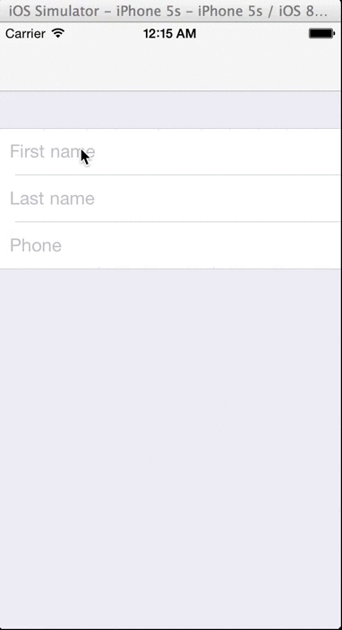

MATextFieldCell
==================

MATextFieldCell is a drop-in subclass of UITableViewCell, written in Swift, used for drastically streamlining UITableView-based form creation. Harnessing the power and convenience of closures, and coming out-of-the-box with a handful of the most common form-field types, MATextFieldCells allow for quick and easy customization of everything from navigation from field to field to maintaining proper data domains and formats. It is carefully designed for developer ease-of-use, abstracting away all of the common UITextFieldDelegate protocol code, UIKeyboard return key types, auto-capitilization/correction, and data validation/formatting, so forms can be built and customized fast and with less code.


Usage
=====

Simply drop in MATextFieldCell.swift into your project and you're ready to go!

**Example**

Create three MATextFieldCells, providing the appropriate type and action values conveniently at init-time, and let us do all the hard work. Provided those two pieces of information, we do all the heavy lifting and customize the keyboard types, data domains, placeholders, return key types and/or add toolbars for numeric keyboards, and entry formatting for the most commonly used types of form fields. Then pass in a closure as the action block to be handled when users hit the appropriate next/done/return buttons.

```js
let firstNameCell: MATextFieldCell = MATextFieldCell(type: MATextFieldType.Name, action: MATextFieldActionType.Next)
let lastNameCell: MATextFieldCell = MATextFieldCell(type: MATextFieldType.Name, action: MATextFieldActionType.Next)
let phoneCell: MATextFieldCell = MATextFieldCell(type: MATextFieldType.Phone, action: MATextFieldActionType.Done)

firstNameCell.textField.placeholder = "First name"
firstNameCell.actionBlock = {
  lastNameCell.textField.becomeFirstResponder()
  return
}

lastNameCell.textField.placeholder = "Last name"
lastNameCell.actionBlock = {
  phoneCell.textField.becomeFirstResponder()
  return
}

phoneCell.actionBlock = {
  phoneCell.textField.resignFirstResponder()
  return
}
```

Load up these cells into your table view and you'll get the following:




If for any reason your specific implementation calls for a unique/custom format/actions, don't provide the optional type and action params at init-time and we'll create a default cell with a textfield and normal keyboard for you to customize however you'd like.

```js
let yourCell: MATextFieldCell = MATextFieldCell(type: nil, action: nil)
yourCell.textField. // customize to your heart's content
```


MATextFieldType and Standard Settings
=====

**.Default**
  - auto-capitalize new sentences
  - auto-correction on
  - default keyboard
  
**.Name**
  - auto-capitalize all words
  - auto-correction off
  - default keyboard
  
**.Phone**
  - number pad keyboard
  - automatically adds "Phone" placeholder
  - auto-formats text following format: (xxx) xxx-xxxx
  - adds toolbar to keyboard for action button
  
**.Email**
  - auto-capitalize off
  - auto-correction off
  - email keyboard
  - automatically adds "Email" placeholder
  
**.Address**
  - auto-capitalize all words
  - auto-correction on
  - default keyboard
  
**.StateAbbr**
  - auto-capitalize all characters
  - auto-correction off
  - default keyboard
  - 2 character limit
  - automatically adds "State" placeholder
  
**.ZIP**
  - number pad keyboard
  - 5 digit limit
  - automatically adds "ZIP" placeholder
  
**.Number**
  - number pad keyboard
  
**.Decimal**
  - decimal pad keyboard

  
MATextFieldActionTypes
=====

**.None**
  - does not create action bar/button, and uses default return key type for keyboard. Hitting 'return' on the keyboard does nothing.
  
**.Next**
  - if the field type requires a numeric keyboard and therefore has no 'return key', a toolbar is created and added as an input accessory view to the keyboard with "Next" as the title. You'll want to be sure you also implement the expected action (switch which textfield is the firstResponder) inside the actionBlock property as shown above.
  - if the field type has a keyboard that includes a 'return key', the return key type is set to "Next". You'll want to be sure you also implement the expected action (switch which textfield is the firstResponder) inside the actionBlock property as shown above.

**.Done**
  - if the field type requires a numeric keyboard and therefore has no 'return key', a toolbar is created and added as an input accessory view to the keyboard with "Done" as the title. You'll want to be sure you also implement the expected action (resign the appropriate first responder) inside the actionBlock property as shown above.
  - if the field type has a keyboard that includes a 'return key', the return key type is set to "Done". You'll want to be sure you also implement the expected action (resign the appropriate first responder) inside the actionBlock property as shown above.
