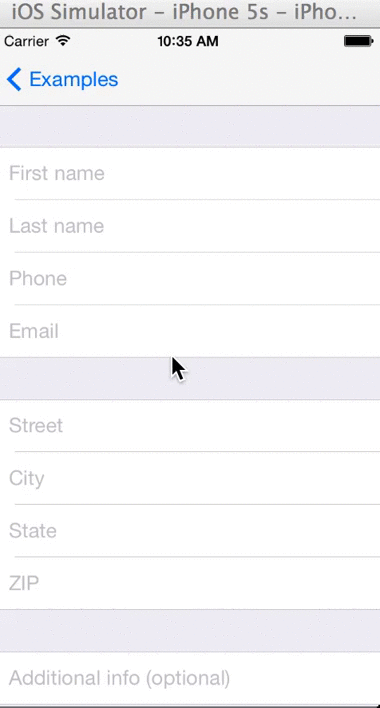

MATextFieldCell
==================

MATextFieldCell is a drop-in subclass of UITableViewCell, written in both Objective-C and Swift, used for drastically streamlining UITableView-based form creation. Harnessing the power and convenience of swift closures and Objective-C blocks, and coming out-of-the-box with a handful of the most common form-field types, MATextFieldCells allow for quick and easy customization of everything from navigation from field to field to maintaining proper data domains and formats. It is carefully designed for developer ease-of-use, abstracting away all of the common UITextFieldDelegate protocol code, UIKeyboard return key types, auto-capitilization/correction, and data validation/formatting, so forms can be built and customized fast and with less code.


Usage
=====

Simply drop in MATextFieldCell.swift or MATextFieldCell.h/m into your project and you're ready to go!

**Example**

Creating a form is simple with MATextFieldCells. Here we will create a short 3-field form asking for the user's first name, last name, and phone number. We'll create three MATextFieldCells, providing the appropriate type and action values conveniently at init-time, and under the hood we're configuring lots of extras to make it easier for you and intuitive for your users. Provided the type and action, we'll customize the keyboard types, data domains, return key types and/or add toolbars for numeric keyboards, and entry formatting for the most commonly used types of form fields. All you then have to do is pass in a closure as the action block to be handled when users hit the appropriate next/done/return buttons, and filling out the form will be a quick and user-friendly experience and you don't have to muck around writing all of the delegate and keyboard customization code that bloats your view controllers.

**Swift**

```js
let firstNameCell: MATextFieldCell = MATextFieldCell(type: MATextFieldType.Name, action: MATextFieldActionType.Next)
let lastNameCell: MATextFieldCell = MATextFieldCell(type: MATextFieldType.Name, action: MATextFieldActionType.Next)
let phoneCell: MATextFieldCell = MATextFieldCell(type: MATextFieldType.Phone, action: MATextFieldActionType.Done)

firstNameCell.textField.placeholder = "First name"
firstNameCell.actionBlock = {
  lastNameCell.textField.becomeFirstResponder()
  return
}

lastNameCell.textField.placeholder = "Last name"
lastNameCell.actionBlock = {
  phoneCell.textField.becomeFirstResponder()
  return
}

phoneCell.textField.placeHolder = "Phone"
phoneCell.actionBlock = {
  phoneCell.textField.resignFirstResponder()
  return
}
```

**Objective-C**

```js
_firstNameCell = [[MATextFieldCell alloc] initWithFieldType:MATextFieldTypeName action:MATextFieldActionTypeNext actionHandler:^{
        [_lastNameCell.textField becomeFirstResponder];
    }];
    _firstNameCell.textField.placeholder = @"First name";
    
    _lastNameCell = [[MATextFieldCell alloc] initWithFieldType:MATextFieldTypeName action:MATextFieldActionTypeNext actionHandler:^{
        [_phoneCell.textField becomeFirstResponder];
    }];
    _lastNameCell.textField.placeholder = @"Last name";
    
    _phoneCell = [[MATextFieldCell alloc] initWithFieldType:MATextFieldTypePhone action:MATextFieldActionTypeNext actionHandler:^{
        [_emailCell.textField becomeFirstResponder];
    }];
    _phoneCell.textField.placeholder = @"Phone";
```

Load up these cells into your table view and you'll get the following:


If for any reason your specific implementation calls for a unique/custom format/actions, don't provide the optional type and action params at init-time and we'll create a default cell with a textfield and normal keyboard for you to customize however you'd like. In swift, you can provide nil, and in objective-c you can provide 0 or the default/none constant values.

```js
let yourCell: MATextFieldCell = MATextFieldCell(type: nil, action: nil)
yourCell.textField. // customize to your heart's content
```


Add just a few more lines with more of the provided options, and you have a robust and user-friendly form that will fit almost all of the most common form types:




MATextFieldTypes and Standard Settings
=====

**Default**
  - auto-capitalize new sentences
  - auto-correction on
  - default keyboard
  
**Name**
  - auto-capitalize all words
  - auto-correction off
  - default keyboard
  
**Phone**
  - number pad keyboard
  - auto-formats text following format: (xxx) xxx-xxxx
  - adds toolbar to keyboard for action button
  
**Email**
  - auto-capitalize off
  - auto-correction off
  - email keyboard
  
**Address**
  - auto-capitalize all words
  - auto-correction on
  - default keyboard
  
**StateAbbr**
  - auto-capitalize all characters
  - auto-correction off
  - default keyboard
  - 2 character limit
  
**ZIP**
  - number pad keyboard
  - 5 digit limit
  
**Number**
  - number pad keyboard
  
**Decimal**
  - decimal pad keyboard

**Password**
  - auto-capitalize off
  - auto-correction off
  - default keyboard
  - secure text entry (characters are obfuscated)
  
**URL**
  - auto-capitalize off
  - auto-correction off
  - URL keyboard

**NonEditable**
  - disable the textfield - for display/informational purposes

MATextFieldActionTypes
=====

**None**
  - does not create action bar/button, and uses default return key type for keyboard. Hitting 'return' on the keyboard does nothing.
  
**Next**
  - if the field type requires a numeric keyboard and therefore has no 'return key', a toolbar is created and added as an input accessory view to the keyboard with "Next" as the title. You'll want to be sure you also implement the expected action (switch which textfield is the firstResponder) inside the actionBlock property as shown above.
  - if the field type has a keyboard that includes a 'return key', the return key type is set to "Next". You'll want to be sure you also implement the expected action (switch which textfield is the firstResponder) inside the actionBlock property as shown above.

**Done**
  - if the field type requires a numeric keyboard and therefore has no 'return key', a toolbar is created and added as an input accessory view to the keyboard with "Done" as the title. You'll want to be sure you also implement the expected action (resign the appropriate first responder) inside the actionBlock property as shown above.
  - if the field type has a keyboard that includes a 'return key', the return key type is set to "Done". You'll want to be sure you also implement the expected action (resign the appropriate first responder) inside the actionBlock property as shown above.
